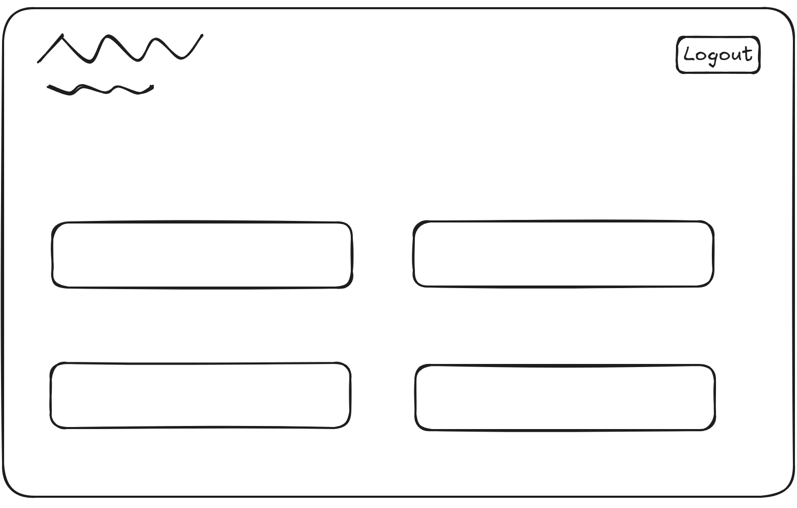

# Full-Stack Learning Management System Overview

This project is a full-stack Learning Management System (LMS) built with **Django** for the backend and **React** for the frontend. It is designed to support students, teachers, and administrators through authentication, course management, and role-based access.

## 📁 Project Structure

```text
root/
├── backend/
│   ├── config/
│   ├── courses/
│   ├── students/
│   ├── .env
│   ├── .env.example
│   ├── db.sqlite3
│   └── manage.py
├── frontend/
│   └── react-auth-app/
│       ├── build/
│       ├── node_modules/
│       ├── public/
│       ├── src/
│       ├── craco.config.js
│       ├── package-lock.json
│       ├── package.json
│       ├── postcss.config.js
│       ├── tailwind.config.js
│       └── tsconfig.json
├── .gitignore
├── package-lock.json
├── package.json
└── README.md
```

## 🚀 Features

- ✅ User authentication with login, signup, and role handling
- 📚 Course browsing and course management
- 🔒 Role-based access for students, teachers, and admins

## ⚙️ Tech Stack

| Layer     | Technology                    |
| --------- | ----------------------------- |
| Frontend  | React, CRACO, TypeScript      |
| Backend   | Django, Django REST Framework |
| Database  | SQLite                        |
| Auth      | JWT authentication            |
| Dev Tools | Git, GitHub, ESLint, Tailwind |

- VSCode was used as my main tool in order to write/edit code
- Git was used to deal with the version control of my website
- GitHub was used to host the code of my website
- HTML/React was used as the foundation/structure of my site
- CSS was used to style and edit the layout of my site
- Django was used to build the backend
- React was used to build the frontend

## Dashboard Front-End Wireframe

#### Below is an example of what I envisioned my Dashboard Wireframe to look like.



## Technical Architecture

#### Data Flow and Authentication

1. User authenticates via the frontend.
2. Backend then verifies user credentials and returns JWT tokens as well as user profile data.
3. Frontend stores auth state and role.
4. Protected requests include an access token.
5. Backend validates token/permissions and then runs serializer/model operations and returns JSON.

#### Navigation and Authentication

1. React Router controls the page navigation.
2. Route guards restrict page access by authentication state and role.
3. Redux stores the authenticated user state and tokens.
4. Axios client sends out API requests with JWT auth headers.
5. Pages use the API responses in order to render role-specific actions be it enrolment, managing courses or managing users.

## Testing

#### Backend

```powershell
cd backend
C:/Users/2000S/AppData/Local/Python/pythoncore-3.14-64/python.exe manage.py test
```

#### Frontend

```powershell
cd frontend/react-auth-app
$env:CI='true'; npx craco test --watchAll=false --runInBand
```

## API Endpoints

The Base URL: `http://127.0.0.1:8000/api`

- `POST /auth/register/` creates a user account.
- `POST /auth/login/` returns JWT access and refresh tokens.
- `POST /auth/refresh/` refreshes an access token.
- `GET /courses/` lists courses (authenticated users).
- `GET /courses/{id}/` retrieves course details.
- `POST /courses/` creates a course (teacher/admin).
- `PUT /courses/{id}/` updates a course (teacher/admin).
- `DELETE /courses/{id}/` deletes a course (teacher/admin).
- `GET /courses/my-enrollments/` lists the current user's enrollments.
- `POST /courses/{id}/enrollments/` enrols the current student in a course.
- `GET /courses/{id}/enrollments/` lists enrollments for a course (teacher/admin, with owner fallback logic).
- `GET /user/` lists all users for admin, otherwise returns the current user only.
- `POST /user/` creates a user account as teacher or student (admin only).
- `PATCH /user/{id}/` updates a user's active status or role (admin only).

## Deployment

#### Frontend

#### My React App was deployed to GitHub Pages through the use of the following commands:

1. npm install gh-pages --save-dev
2. Updating my package.json files
3. npm run deploy

#### Backend

- WIP

## 🛠️ Setup Instructions

#### 🔹 Backend (Django)

```powershell
cd backend
copy .env.example .env
C:/Users/2000S/AppData/Local/Python/pythoncore-3.14-64/python.exe manage.py migrate
C:/Users/2000S/AppData/Local/Python/pythoncore-3.14-64/python.exe manage.py runserver
```

#### 🔹 Frontend (React)

```powershell
cd frontend/react-auth-app
npm install
npm start
```

## Credits/Validation

#### Code validation carried out using the following tools and methods:

- [HTML Validator](https://validator.w3.org/nu/#textarea)
- [CSS Validator](https://jigsaw.w3.org/css-validator/#validate_by_input)
- [React Testing Library](https://testing-library.com/docs/react-testing-library/intro/)
- Django's built-in test framework for backend integration testing
